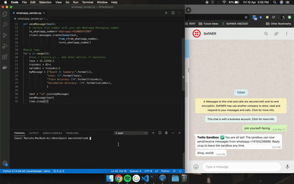

# WhatsEpoch
A WhatsApp Notification client for you long model training nights :night_with_stars:

My recent ventures into cutting edge deep learning models has also pulled me towards anxious nights of model training.
Models like RESNET, BERT, Hierarchial Multi Task Learners etc ate away a ton of time, just staring at the screen. I even started keeping a loop
of alarms to get up. But the worst happened when I got up in the morning to see that my SSH session had crashed. Now that is NOT
a good start to a day.

So I turned towards twilio and made this simple python wrapper to use a twilio account to send notifications on my whatsapp number :clinking_glasses:

The setup is simple and WORTHHH IT!!!

#### Step 1: Follow this link and setup a FREE twillio account: https://www.twilio.com/
#### Step 2: Note down your ACCOUNT_ID and AUTH_TOKEN and paste it in your file as [variables](https://github.com/ManishShettyM/WhatsEpoch/blob/8648a3b4ca67d3ef8e2879fe69fa0a5e14539c65/whatsapp_sender.py#L5)
 
#### Step 3: Create a whatsapp sandbox on your twillio account and a WhatsApp contact for your notifications
 1. Go to the WhatsApp page in the Twilio Console and activate the sandbox.
 2. You will be redirected to the page above which instructs you how to connect to your sandbox by sending a WhatsApp message through your device. In my case, I’m required to send join yourself-facing to +14155238886.
#### Step4: Use [whatsapp_sender](https://github.com/ManishShettyM/WhatsEpoch/blob/master/whatsapp_sender.py) as a reference and add the necessary messages to your training file

### and et voilà, there is your cool notifier for an calm night of sleep.

*~ For all those fellow buddies dealing with anxiety :nerd_face: ~*
